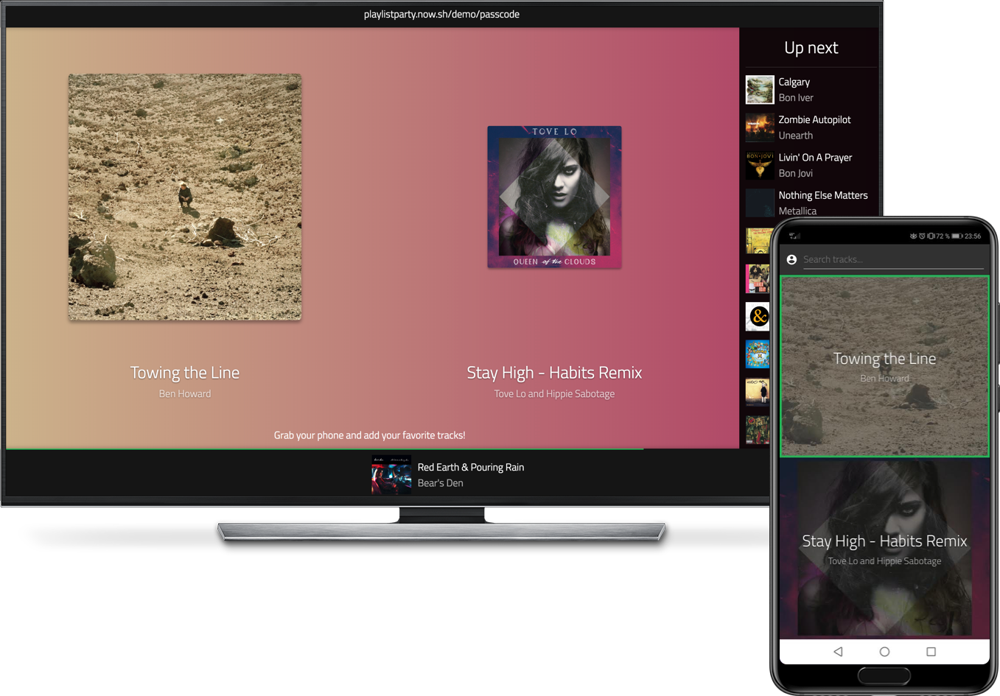

[](https://travis-ci.org/antoinechalifour/playlist.party-client) [](https://standardjs.com) [](https://github.com/prettier/prettier)

# Playlist Party - Client

This project was bootstrapped with [Create React App](https://github.com/facebookincubator/create-react-app).

I use [Figma](https://www.figma.com/file/TgDRFpznOVcL5mpdQ47dKCXT/Mixyu) to work on the design part.



> Playlist Party is a collaborative playlist builder. You **need** a premium Spotify account to use it.

## Features

- Create a private party with a pass code
- Guests can join your party if they have the code
- Guests can submit their favorite tracks
- Guests can vote between the next 2 tracks
- The most requested track gets played next

## Tech

- Socket.io for creating parties
- WebRTC (p2p communications) once a party is joined
- React + Redux + Redux-Saga + Styled Components

## Development environment

```sh
# Create your environment file
cp .env.sample .env

# Replace the placeholder values with your environment values (see next section)
nano .env.sample

# Install dependencies
npm install

# These are helpful scripts

# Run unit tests in watch mode
npm test -- --watch

# Build the app
npm run build
```

### Creating the environment file

**Creating a Spotify application:**

- Create a "website" application on the [Spotify developer console](https://developer.spotify.com/dashboard/applications)
- Copy the client ID in your env file
- Save a `redirect_url` and copy it in your env file

**Using a signaling server** - You can either:

- clone the [server source code](https://github.com/antoinechalifour/playlist.party-server) and run it locally. (recommended)
- use the production server url: https://playlistparty-server.now.sh/
